# Judiciary Information System (JIS) — Software Engineering Project Report

**Course:** Software Engineering  
**Project:** Judiciary Information System (JIS)  
**Technology:** Next.js 15 · TypeScript · Prisma · Supabase Postgres  
**Methodology:** Agile-inspired, document-driven (Waterfall artifacts, Agile execution)

---

## Table of Contents

1. [Introduction](#1-introduction)
2. [System Overview & Objectives](#2-system-overview--objectives)
3. [Software Requirements Specification (SRS)](#3-software-requirements-specification-srs)
4. [Technology Stack](#4-technology-stack)
5. [System Architecture](#5-system-architecture)
6. [UML Diagrams](#6-uml-diagrams)
7. [Database Design](#7-database-design)
8. [Data Flow Diagrams](#8-data-flow-diagrams)
9. [API & Server Action Documentation](#9-api--server-action-documentation)
10. [Application Pages & User Interface](#10-application-pages--user-interface)
11. [Role-Based Access Control (RBAC)](#11-role-based-access-control-rbac)
12. [Authentication & Middleware](#12-authentication--middleware)
13. [Input Validation](#13-input-validation)
14. [Testing Strategy & Results](#14-testing-strategy--results)
15. [Edge Cases & Error Handling](#15-edge-cases--error-handling)
16. [Deployment Architecture](#16-deployment-architecture)
17. [Conclusion](#17-conclusion)

---

## 1. Introduction

The **Judiciary Information System (JIS)** is a full-stack web application designed for managing court cases, hearing schedules, and judicial records. It serves as a centralized digital records system for three categories of judicial personnel:

- **Registrars** — Administrative officers who manage user accounts, courtroom facilities, case dockets, hearing schedules, adjournments, proceeding summaries, and final judgments.
- **Judges** — Judicial officers who can browse and research closed case archives at no charge for precedent analysis.
- **Lawyers** — Legal counsel (prosecutors and defense attorneys) who can search and inspect closed case records, with each inspection billed at a statutory fee of ₹50.00 per view.

The system implements the complete **case lifecycle**: from initial registration and CIN generation, through hearing scheduling and adjournment cycles, to final judgment recording and case closure. All mutations are tracked in an immutable audit log for accountability and compliance.

---

## 2. System Overview & Objectives

### 2.1 Problem Statement

Indian judiciary courts rely on manual registers and fragmented digital tools for case tracking. This leads to:
- Lost or misplaced case files
- Scheduling conflicts (judges double-booked, courtrooms overbooked)
- No centralized search for case precedent
- No billing transparency for lawyer case access
- No audit trail for administrative actions

### 2.2 Objectives

1. Provide a secure, role-based digital platform for court case management
2. Automate unique Case Identification Number (CIN) generation
3. Enforce hearing slot capacity constraints per courtroom per day
4. Detect and prevent judge scheduling conflicts
5. Maintain an immutable, append-only audit trail for all mutations
6. Implement per-view billing for lawyer case access
7. Enable full-text keyword search across case archives
8. Deliver a professional government records aesthetic (not generic SaaS)

### 2.3 Core Workflow

```
Registrar creates case → CIN generated → Hearing scheduled →
  → Hearing held (summary recorded) OR Adjourned (reason + next date) →
  → Cycle continues until concluded →
  → Judgment recorded → Case marked CLOSED →
  → Archived for Judge/Lawyer research
```

---

## 3. Software Requirements Specification (SRS)

### 3.1 Functional Requirements

#### Module A — User & Account Management

| ID | Requirement |
|----|-------------|
| FR1 | Registrar can create login accounts for Judges, Lawyers, and other Registrars, assigning a statutory role at creation |
| FR2 | Registrar can deactivate/reactivate any login account (soft-delete) |
| FR3 | System must authenticate users and restrict features by role (Registrar / Judge / Lawyer) |
| FR4 | System must track, per lawyer account, the count and log of each closed case viewed (for billing) |

#### Module B — Case Registration

| ID | Requirement |
|----|-------------|
| FR5 | Registrar can create a new court case by entering: defendant name, address, crime type, date of crime, crime location, arresting officer, date of arrest |
| FR6 | System auto-generates a unique Case Identification Number (CIN) on case creation |
| FR7 | Registrar additionally records: presiding judge, public prosecutor, defense lawyer, trial start date, expected completion date |

#### Module C — Hearing Scheduling

| ID | Requirement |
|----|-------------|
| FR8 | System displays available (vacant) hearing slots for any selected working day, given judge/courtroom availability |
| FR9 | Registrar assigns a hearing date to a case from the displayed vacant slots |
| FR10 | On adjournment, registrar records a reason for adjournment and assigns a new hearing date |
| FR11 | After a hearing occurs, registrar records a summary of proceedings and assigns the next hearing date (if not concluded) |

#### Module D — Case Resolution

| ID | Requirement |
|----|-------------|
| FR12 | On completion, registrar records the judgment summary and marks the case as Closed/Resolved |
| FR13 | Closed case records and their full history remain permanently accessible (read-only) for future reference |

#### Module E — Registrar Queries

| ID | Requirement |
|----|-------------|
| FR14 | Query pending cases sorted by CIN: start date, defendant name & address, crime details, lawyer, prosecutor, judge |
| FR15 | Query resolved cases within a given date range: start date, CIN, judgment date, judge, judgment summary |
| FR16 | Query cases scheduled for hearing on a specific date |
| FR17 | Query full status/history of a specific case by CIN |

#### Module F — Case History & Search

| ID | Requirement |
|----|-------------|
| FR18 | Judges can browse full details of any past (closed) case at no charge |
| FR19 | Lawyers can browse past case details but are charged ₹50 per view; each view is logged |
| FR20 | Keyword search across past case records (crime type, defendant, judge, judgment terms) |

#### Module G — Audit & History

| ID | Requirement |
|----|-------------|
| FR21 | All adjournments, hearing summaries, and judgment entries stored as immutable, timestamped history per case |

### 3.2 Non-Functional Requirements

| ID | Category | Requirement |
|----|----------|-------------|
| NFR1 | Security | Role-based access control enforced at application and database (RLS) level; passwords hashed via Supabase Auth |
| NFR2 | Data Integrity | Case history is append-only — never destructively edited or deleted |
| NFR3 | Availability | Target 99% uptime during court working hours (managed infrastructure) |
| NFR4 | Performance | Case queries return results in under 2 seconds for up to ~50,000 cases |
| NFR5 | Usability | UI usable by non-technical registrars/judges with minimal training |
| NFR6 | Scalability | Schema supports adding more courts/branches without redesign |
| NFR7 | Auditability | Every billable view and account mutation logged with timestamp and actor |
| NFR8 | Maintainability | Layered structure with typed schema (Prisma) to keep DB and code in sync |
| NFR9 | Accessibility | Basic WCAG 2.1 AA practices (contrast, keyboard navigation, semantic HTML) |
| NFR10 | Portability | Deployable to any standard Node.js hosting; database is standard Postgres |

---

## 4. Technology Stack

| Layer | Technology | Version | Purpose |
|-------|-----------|---------|---------|
| Framework | Next.js (App Router) | 15.x | Full-stack React framework with Server Components and Server Actions |
| Language | TypeScript | 5.6+ | Type-safe development across frontend and backend |
| UI Library | React | 19 | Component-based user interface rendering |
| Styling | Tailwind CSS | 4.x | Utility-first CSS framework |
| Component Library | shadcn/ui | latest | Pre-built accessible UI components (Button, Table, Dialog, Form, etc.) |
| Icons | lucide-react | latest | Consistent icon library |
| Database | Supabase Postgres | — | Managed PostgreSQL with Row-Level Security |
| Authentication | Supabase Auth | — | Email/password authentication with session management |
| ORM | Prisma | 5.x | Type-safe database access layer and schema management |
| Forms | react-hook-form + zod | latest | Form state management with schema-based validation |
| Unit Testing | Vitest | latest | Fast unit test runner with mocking support |
| E2E Testing | Playwright | latest | Cross-browser end-to-end integration testing |
| Deployment | Vercel + Supabase Cloud | — | Serverless hosting + managed database |

### Why This Stack?

- **Next.js App Router** eliminates the need for a separate API server — Server Actions provide type-safe RPC directly from the UI layer to the database
- **Prisma** keeps the TypeScript types and database schema perfectly synchronized
- **Supabase** provides Postgres + Auth as a managed service, removing infrastructure burden
- **shadcn/ui** delivers accessible, unstyled components that match the government records aesthetic
- **Zod** schemas are shared between client-side form validation and server-side input verification, ensuring consistent rules

---

## 5. System Architecture

### 5.1 Layered / 3-Tier Architecture

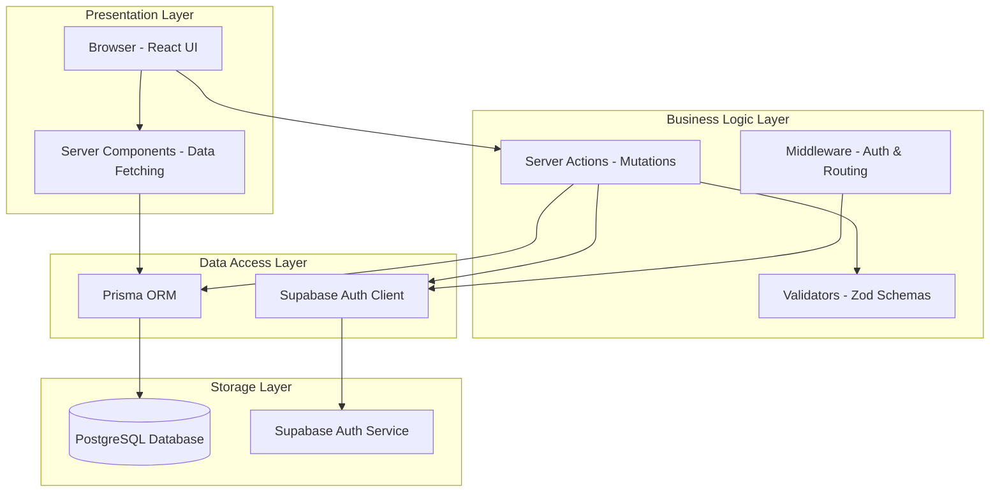

### 5.2 Component / Deployment Diagram

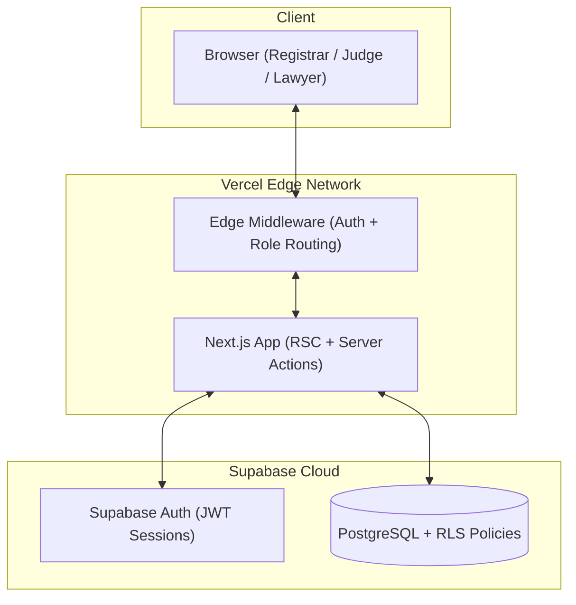

### 5.3 Directory Structure

```
jis/
├── app/
│   ├── page.tsx                    # Public landing page
│   ├── layout.tsx                  # Root layout (fonts, toaster, providers)
│   ├── globals.css                 # Theme variables & Tailwind config
│   ├── favicon.ico                 # Application icon
│   ├── (auth)/
│   │   └── login/page.tsx          # Authentication page
│   └── (dashboard)/
│       ├── layout.tsx              # Dashboard shell (sidebar + topbar)
│       ├── registrar/
│       │   ├── page.tsx            # Registrar dashboard (KPIs + today's hearings)
│       │   ├── accounts/page.tsx   # Personnel directory
│       │   ├── courtrooms/page.tsx # Courtroom management
│       │   ├── analytics/page.tsx  # Caseload analytics & charts
│       │   ├── audit/page.tsx      # Audit trail viewer
│       │   ├── hearings/page.tsx   # Daily hearing docket
│       │   └── cases/
│       │       ├── page.tsx        # Full case docket register
│       │       ├── new/page.tsx    # Case registration form
│       │       ├── [cin]/page.tsx  # Case detail + hearing timeline
│       │       ├── pending/page.tsx    # Pending litigations
│       │       ├── resolved/page.tsx   # Resolved judgments
│       │       └── by-hearing/page.tsx # Cases by hearing date
│       ├── judge/
│       │   ├── page.tsx            # Judge dashboard
│       │   └── history/
│       │       ├── page.tsx        # Case law archive
│       │       └── [cin]/page.tsx  # Case detail (free access)
│       └── lawyer/
│           ├── page.tsx            # Lawyer dashboard (billing KPIs)
│           ├── billing/page.tsx    # Itemized billing ledger
│           └── history/
│               ├── page.tsx        # Case law archive (paid)
│               └── [cin]/page.tsx  # Case detail (₹50 billed)
├── actions/                        # Server Actions (business logic)
│   ├── auth.actions.ts
│   ├── user.actions.ts
│   ├── courtroom.actions.ts
│   ├── case.actions.ts
│   ├── hearing.actions.ts
│   ├── caseView.actions.ts
│   ├── audit.actions.ts
│   └── analytics.actions.ts
├── lib/
│   ├── auth.ts                     # getCurrentUser() helper
│   ├── prisma.ts                   # Singleton Prisma client
│   ├── constants.ts                # CHARGE_PER_VIEW = 50.0
│   ├── nav-config.ts               # Role-based sidebar navigation
│   ├── supabase/
│   │   ├── server.ts               # SSR Supabase client + Admin client
│   │   └── client.ts               # Browser Supabase client
│   └── validators/
│       ├── auth.ts                 # loginSchema
│       ├── user.ts                 # createUserSchema, deactivateUserSchema
│       ├── courtroom.ts            # createCourtroomSchema, updateCourtroomSchema
│       ├── case.ts                 # createCaseSchema, recordJudgmentSchema
│       └── hearing.ts             # scheduleHearingSchema, recordAdjournmentSchema, recordSummarySchema
├── components/
│   ├── ui/                         # shadcn/ui components (DO NOT edit)
│   ├── shared/                     # Project-specific shared components
│   │   ├── dashboard-shell.tsx
│   │   ├── sidebar.tsx
│   │   ├── topbar.tsx
│   │   ├── cin-badge.tsx
│   │   ├── case-detail.tsx
│   │   ├── case-search.tsx
│   │   ├── hearing-timeline.tsx
│   │   └── table-skeleton.tsx
│   └── analytics/                  # Custom SVG chart components
│       ├── analytics-print-button.tsx
│       ├── monthly-trend-chart.tsx
│       ├── status-breakdown-chart.tsx
│       ├── hearing-efficiency-card.tsx
│       └── courtroom-utilization-card.tsx
├── prisma/
│   ├── schema.prisma               # Database schema (source of truth)
│   └── seed.ts                     # Development seed data
├── tests/
│   ├── unit/                       # Vitest unit tests (48 cases)
│   └── e2e/                        # Playwright E2E tests (11 cases)
├── middleware.ts                    # Edge auth + role routing
├── vitest.config.ts
├── playwright.config.ts
└── package.json
```

---

## 6. UML Diagrams

### 6.1 Use Case Diagram

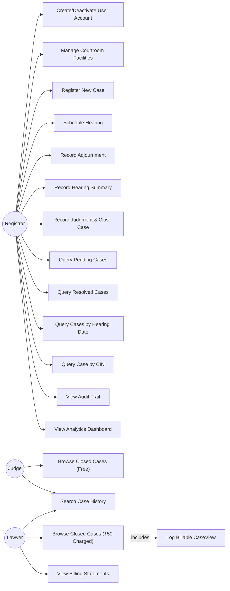

### 6.2 Class Diagram

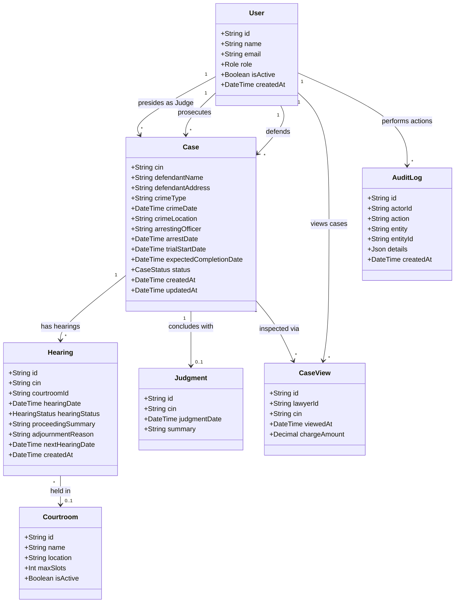

### 6.3 Entity-Relationship Diagram

```mermaid
erDiagram
    USERS ||--o{ CASES : "assigned as judge/prosecutor/lawyer"
    CASES ||--o{ HEARINGS : "has"
    CASES ||--o| JUDGMENTS : "resolved by"
    USERS ||--o{ CASE_VIEWS : "logs"
    CASES ||--o{ CASE_VIEWS : "viewed in"
    COURTROOMS ||--o{ HEARINGS : "hosts"
    USERS ||--o{ AUDIT_LOGS : "performed"

    USERS {
        uuid id PK
        string name
        string email UK
        enum role
        boolean is_active
        timestamp created_at
    }
    COURTROOMS {
        uuid id PK
        string name UK
        string location
        int max_slots
        boolean is_active
    }
    CASES {
        string cin PK
        string defendant_name
        string defendant_address
        string crime_type
        date crime_date
        string crime_location
        string arresting_officer
        date arrest_date
        uuid judge_id FK
        uuid prosecutor_id FK
        uuid lawyer_id FK
        date trial_start_date
        date expected_completion_date
        enum status
        timestamp created_at
        timestamp updated_at
    }
    HEARINGS {
        uuid id PK
        string cin FK
        uuid courtroom_id FK
        date hearing_date
        enum hearing_status
        string proceeding_summary
        string adjournment_reason
        date next_hearing_date
        timestamp created_at
    }
    JUDGMENTS {
        uuid id PK
        string cin FK_UK
        date judgment_date
        string summary
    }
    CASE_VIEWS {
        uuid id PK
        uuid lawyer_id FK
        string cin FK
        timestamp viewed_at
        decimal charge_amount
    }
    AUDIT_LOGS {
        uuid id PK
        uuid actor_id FK
        string action
        string entity
        string entity_id
        json details
        timestamp created_at
    }
```

### 6.4 Sequence Diagram — Register a New Case

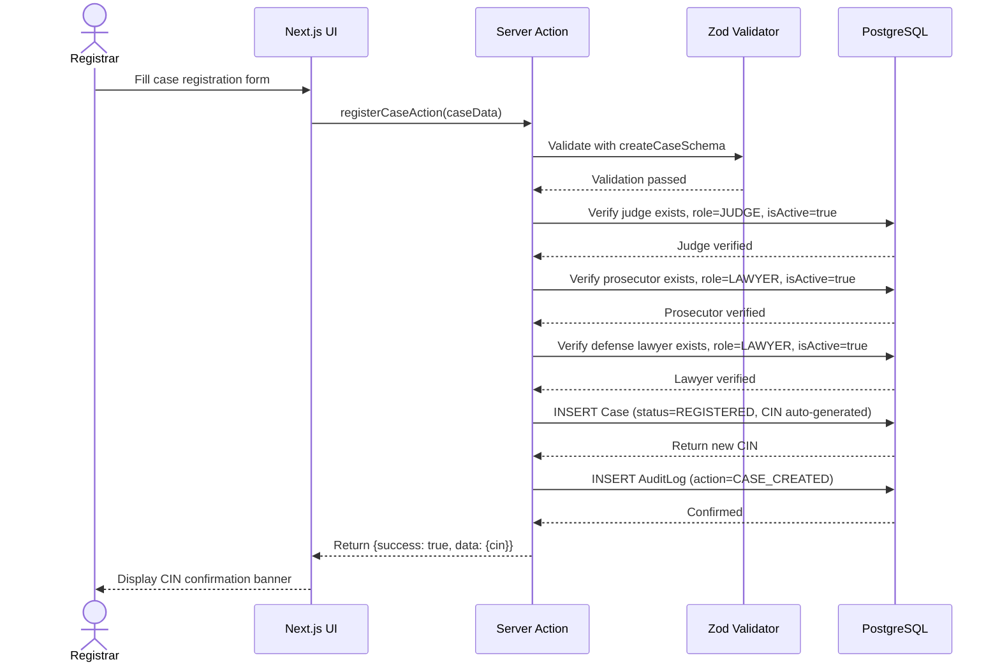

### 6.5 Sequence Diagram — Schedule a Hearing

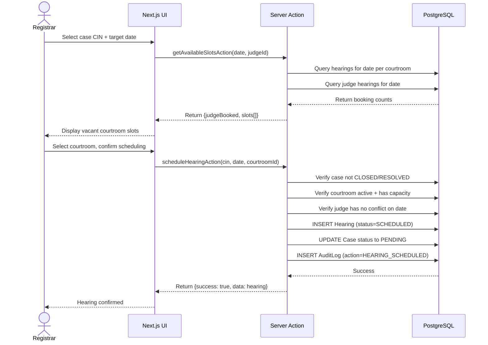

### 6.6 Sequence Diagram — Lawyer Views Closed Case (Billable)

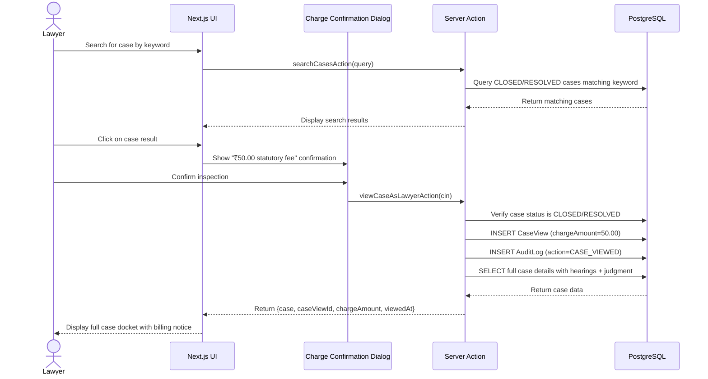

### 6.7 Sequence Diagram — Record Adjournment

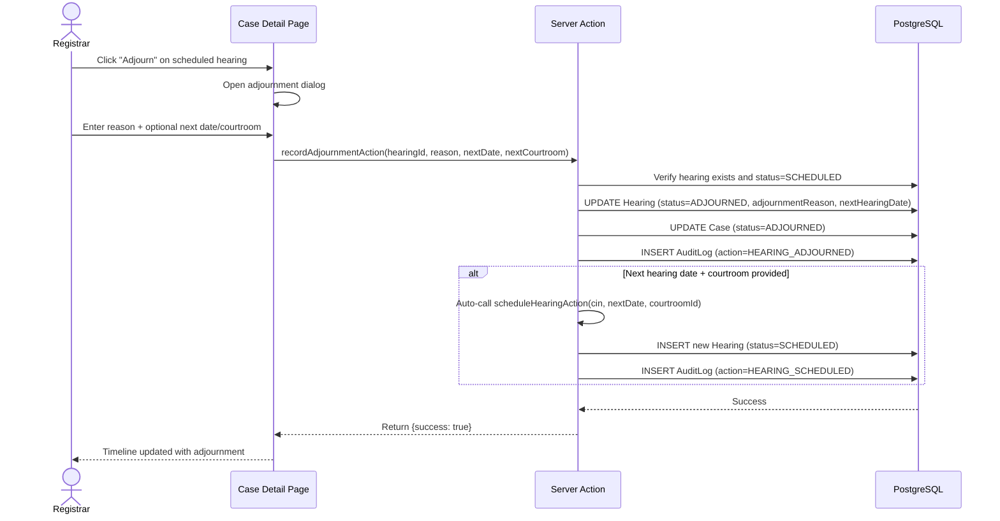

### 6.8 Activity Diagram — Case Lifecycle

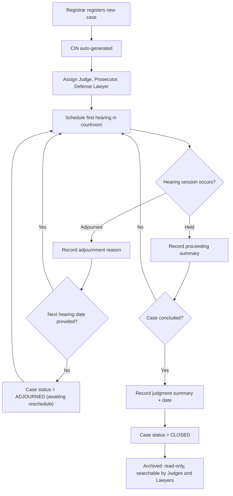

### 6.9 State Diagram — Case Status

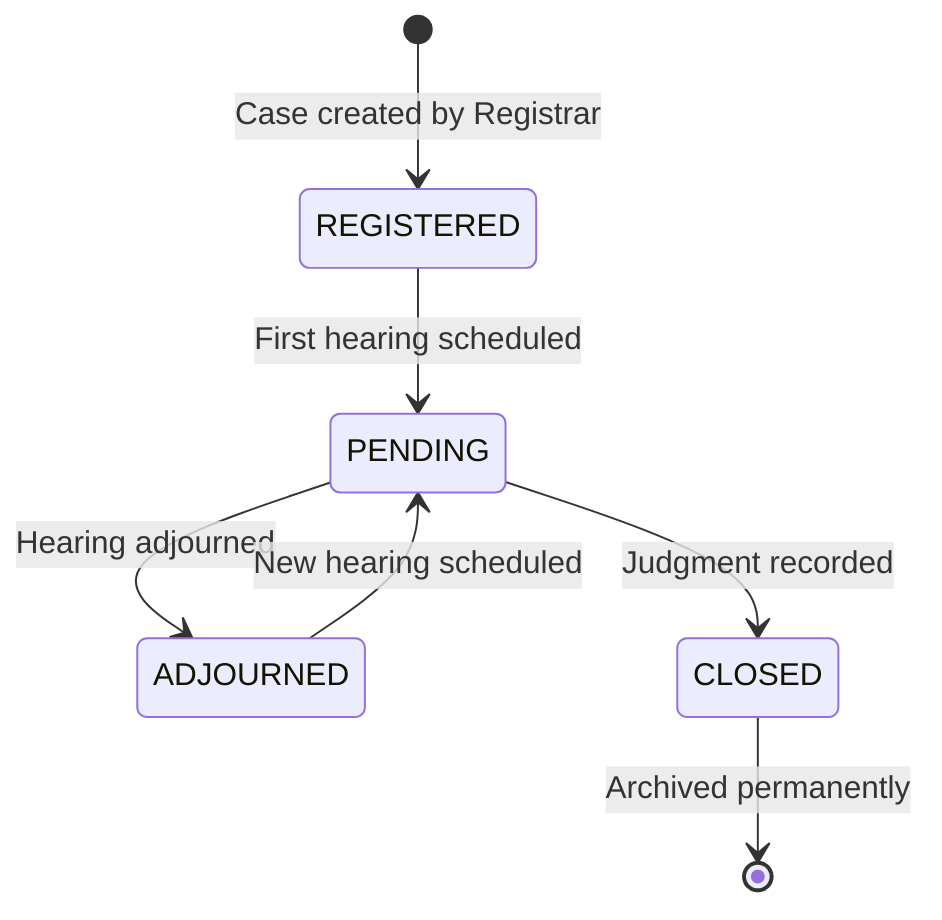

### 6.10 State Diagram — Hearing Status

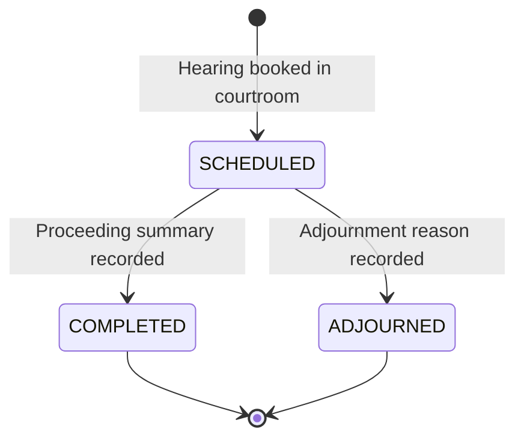

---

## 7. Database Design

### 7.1 Models & Relationships

The database consists of **7 models** and **3 enums**:

#### Enums

| Enum | Values | Description |
|------|--------|-------------|
| `Role` | `REGISTRAR`, `JUDGE`, `LAWYER` | Statutory user roles |
| `CaseStatus` | `REGISTERED`, `PENDING`, `ADJOURNED`, `RESOLVED`, `CLOSED` | Case lifecycle states |
| `HearingStatus` | `SCHEDULED`, `COMPLETED`, `ADJOURNED` | Hearing session states |

#### Model: User

| Field | Type | Constraints | Description |
|-------|------|-------------|-------------|
| `id` | String | PK, UUID, auto | Primary key |
| `name` | String | Required | Full name |
| `email` | String | Unique | Login email |
| `role` | Role | Required | Statutory role |
| `isActive` | Boolean | Default: true | Soft-delete flag |
| `createdAt` | DateTime | Default: now() | Registration timestamp |

**Indexes:** `role`

#### Model: Courtroom

| Field | Type | Constraints | Description |
|-------|------|-------------|-------------|
| `id` | String | PK, UUID, auto | Primary key |
| `name` | String | Unique | Chamber identifier |
| `location` | String? | Optional | Physical location |
| `maxSlots` | Int | Default: 5 | Max hearings per day |
| `isActive` | Boolean | Default: true | Operational status |

#### Model: Case

| Field | Type | Constraints | Description |
|-------|------|-------------|-------------|
| `cin` | String | PK, CUID, auto | Case Identification Number |
| `defendantName` | String | Required | Name of accused |
| `defendantAddress` | String | Required | Address of accused |
| `crimeType` | String | Required | Statutory offense |
| `crimeDate` | DateTime | Required | Date crime committed |
| `crimeLocation` | String | Required | Location of crime |
| `arrestingOfficer` | String | Required | Arresting officer name |
| `arrestDate` | DateTime | Required | Date of arrest |
| `trialStartDate` | DateTime | Required | Trial commencement |
| `expectedCompletionDate` | DateTime | Required | Projected conclusion |
| `status` | CaseStatus | Default: REGISTERED | Current lifecycle status |
| `judgeId` | String | FK → User.id | Presiding judge |
| `prosecutorId` | String | FK → User.id | Public prosecutor |
| `lawyerId` | String | FK → User.id | Defense counsel |

**Indexes:** `status`, `judgeId`, `lawyerId`, `crimeType`, `defendantName`, `trialStartDate`

#### Model: Hearing

| Field | Type | Constraints | Description |
|-------|------|-------------|-------------|
| `id` | String | PK, UUID, auto | Primary key |
| `cin` | String | FK → Case.cin | Case reference |
| `courtroomId` | String? | FK → Courtroom.id | Assigned courtroom |
| `hearingDate` | DateTime | Required | Session date/time |
| `hearingStatus` | HearingStatus | Default: SCHEDULED | Session status |
| `proceedingSummary` | String? | Optional | Recorded proceedings |
| `adjournmentReason` | String? | Optional | Reason if adjourned |
| `nextHearingDate` | DateTime? | Optional | Next session date |

**Indexes:** `cin`, `hearingDate`, `(courtroomId, hearingDate)`

#### Model: Judgment

| Field | Type | Constraints | Description |
|-------|------|-------------|-------------|
| `id` | String | PK, UUID, auto | Primary key |
| `cin` | String | Unique, FK → Case.cin | 1:1 with Case |
| `judgmentDate` | DateTime | Required | Date judgment pronounced |
| `summary` | String | Required | Judgment decree text |

**Index:** `judgmentDate`

#### Model: CaseView

| Field | Type | Constraints | Description |
|-------|------|-------------|-------------|
| `id` | String | PK, UUID, auto | Primary key |
| `lawyerId` | String | FK → User.id | Accessing lawyer |
| `cin` | String | FK → Case.cin | Accessed case |
| `viewedAt` | DateTime | Default: now() | Access timestamp |
| `chargeAmount` | Decimal | Default: 0 | Statutory fee (₹50.00) |

**Indexes:** `lawyerId`, `cin`

#### Model: AuditLog

| Field | Type | Constraints | Description |
|-------|------|-------------|-------------|
| `id` | String | PK, UUID, auto | Primary key |
| `actorId` | String | FK → User.id | Performing user |
| `action` | String | Required | Action type (e.g., CASE_CREATED) |
| `entity` | String | Required | Affected entity name |
| `entityId` | String | Required | Affected record ID |
| `details` | Json? | Optional | Structured change payload |
| `createdAt` | DateTime | Default: now() | Tamper-evident timestamp |

**Indexes:** `actorId`, `(entity, entityId)`, `createdAt`

### 7.2 Key Relationships

- `Case` → `User`: Three FK relations (judge, prosecutor, lawyer)
- `Case` → `Hearing`: One-to-many
- `Case` → `Judgment`: One-to-zero-or-one (a case may not yet have a judgment)
- `Case` → `CaseView`: One-to-many (each lawyer inspection creates a new record)
- `Hearing` → `Courtroom`: Many-to-one (optional)
- `User` → `AuditLog`: One-to-many (every mutation logged)

---

## 8. Data Flow Diagrams

### 8.1 Level 0 — Context Diagram

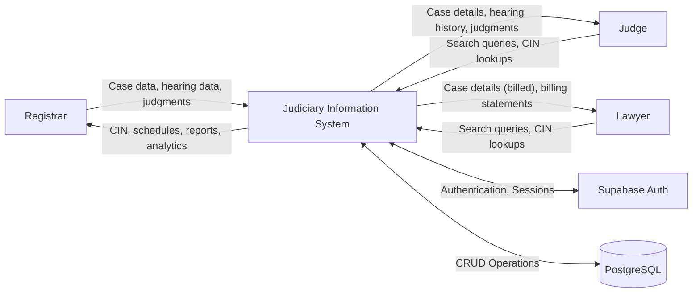

### 8.2 Level 1 — Major Process Areas

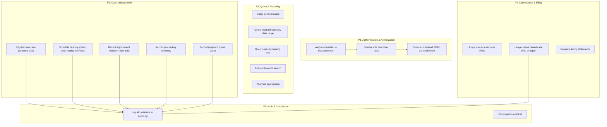

---

## 9. API & Server Action Documentation

The application uses **Next.js Server Actions** exclusively — there are no REST API route handlers (`route.ts`). All data mutations and queries are invoked as typed TypeScript function calls from the UI layer.

Every server action follows a standard pattern:
1. Authenticate the caller via `getCurrentUser()`
2. Verify the caller's role matches the required permission
3. Validate input with the corresponding Zod schema
4. Execute the database operation via Prisma
5. Log the mutation to `AuditLog` (for write operations)
6. Return `{ success: true, data }` or `{ success: false, error: string }`

### 9.1 Authentication Actions (`auth.actions.ts`)

| Action | Input | Role | Description |
|--------|-------|------|-------------|
| `loginAction` | `{email, password}` | Public | Authenticate via Supabase, verify user exists in Prisma, verify account is active, redirect to role-appropriate dashboard |
| `logoutAction` | None | Any | Sign out of Supabase, redirect to `/login` |

### 9.2 User Management Actions (`user.actions.ts`)

| Action | Input | Role | Description |
|--------|-------|------|-------------|
| `createUserAction` | `{name, email, password, role}` | REGISTRAR | Provision credentials in Supabase Auth, create User record in Prisma, log `USER_CREATED` |
| `deactivateUserAction` | `{userId}` | REGISTRAR | Set `isActive=false`, prevent self-deactivation, log `USER_DEACTIVATED` |
| `reactivateUserAction` | `{userId}` | REGISTRAR | Set `isActive=true`, log `USER_REACTIVATED` |
| `getAllUsersAction` | None | REGISTRAR | Return all users ordered by creation date |

### 9.3 Courtroom Management Actions (`courtroom.actions.ts`)

| Action | Input | Role | Description |
|--------|-------|------|-------------|
| `createCourtroomAction` | `{name, location?, maxSlots}` | REGISTRAR | Create courtroom, enforce unique name, log `COURTROOM_CREATED` |
| `updateCourtroomAction` | `{id, name, location?, maxSlots}` | REGISTRAR | Update courtroom properties, log `COURTROOM_UPDATED` |
| `toggleCourtroomActiveAction` | `{id}` | REGISTRAR | Toggle active/inactive status, log accordingly |
| `getAllCourtroomsAction` | None | REGISTRAR | Return all courtrooms alphabetically |

### 9.4 Case Management Actions (`case.actions.ts`)

| Action | Input | Role | Description |
|--------|-------|------|-------------|
| `registerCaseAction` | Full case data | REGISTRAR | Validate personnel assignments (judge is JUDGE, prosecutors and lawyers are LAWYER and active), insert case, generate CIN, log `CASE_CREATED` |
| `getAllCasesAction` | None | REGISTRAR | Return all cases with personnel relations |
| `getActivePersonnelAction` | None | REGISTRAR | Return active judges and lawyers for form dropdowns |
| `recordJudgmentAction` | `{cin, judgmentDate, summary}` | REGISTRAR | Verify case has hearings, no existing judgment, create Judgment + set status=CLOSED in a transaction, log `JUDGMENT_RECORDED` |
| `getPendingCasesAction` | None | REGISTRAR | Return cases with status REGISTERED/PENDING/ADJOURNED |
| `getResolvedCasesAction` | `{fromDate?, toDate?}` | REGISTRAR | Return closed cases with judgments in date range |
| `getCasesByHearingDateAction` | `{date?}` | REGISTRAR | Return cases with hearings on target calendar date |
| `getCaseByCinAction` | `{cin}` | Any | Return full case graph (personnel, hearings, courtrooms, judgment) |
| `searchCasesAction` | `{query}` | Any | Case-insensitive keyword search; Registrar searches all statuses, Judge/Lawyer restricted to CLOSED/RESOLVED |

### 9.5 Hearing Management Actions (`hearing.actions.ts`)

| Action | Input | Role | Description |
|--------|-------|------|-------------|
| `getAvailableSlotsAction` | `{date, judgeId}` | REGISTRAR | Check judge conflict + compute remaining slots per courtroom |
| `scheduleHearingAction` | `{cin, hearingDate, courtroomId}` | REGISTRAR | Verify capacity + judge availability, insert Hearing, promote case to PENDING, log `HEARING_SCHEDULED` |
| `recordAdjournmentAction` | `{hearingId, reason, nextDate?, nextCourtroom?}` | REGISTRAR | Mark hearing ADJOURNED, case ADJOURNED, optionally auto-schedule next hearing, log `HEARING_ADJOURNED` |
| `recordHearingSummaryAction` | `{hearingId, summary, nextDate?, nextCourtroom?}` | REGISTRAR | Mark hearing COMPLETED with summary, optionally schedule next, log `HEARING_COMPLETED` |
| `getHearingsByDateAction` | `{date}` | REGISTRAR | Return all hearings for a calendar day with full relations |

### 9.6 Case View & Billing Actions (`caseView.actions.ts`)

| Action | Input | Role | Description |
|--------|-------|------|-------------|
| `viewCaseAsLawyerAction` | `{cin}` | LAWYER | Verify case is CLOSED/RESOLVED, insert CaseView (₹50.00), log `CASE_VIEWED`, return case details |
| `viewCaseAsJudgeAction` | `{cin}` | JUDGE | Verify case is CLOSED/RESOLVED, return case details (no charge, no CaseView record) |
| `getLawyerBillingAction` | None | LAWYER | Aggregate total views, total charges, monthly breakdown |
| `getClosedCasesAction` | None | Any | Return all CLOSED/RESOLVED cases with judgments |

### 9.7 Audit Actions (`audit.actions.ts`)

| Action | Input | Role | Description |
|--------|-------|------|-------------|
| `logAudit` (helper) | `{actorId, action, entity, entityId, details?}` | Internal | Insert immutable audit record; catches errors silently |
| `getAuditLogsAction` | `{action?, entity?, actorId?, fromDate?, toDate?, page?, pageSize?}` | REGISTRAR | Paginated, filtered audit trail query |
| `getAuditFilterOptionsAction` | None | REGISTRAR | Distinct actions, entities, and actors for filter dropdowns |

### 9.8 Analytics Actions (`analytics.actions.ts`)

| Action | Input | Role | Description |
|--------|-------|------|-------------|
| `getRegistrarAnalyticsAction` | None | REGISTRAR | Aggregate: total/active/disposed cases, clearance rate, avg resolution days, status breakdown, 6-month trend, hearing efficiency, courtroom utilization |

---

## 10. Application Pages & User Interface

The application consists of **21 distinct pages** organized across 4 route groups:

### 10.1 Public Pages

| Route | Page | Description |
|-------|------|-------------|
| `/` | Landing Page | Neoclassical courthouse hero with three role-specific entry cards |
| `/login` | Authentication | Email/password login with inline Zod validation |

### 10.2 Registrar Dashboard (11 pages)

| Route | Page | Key Features |
|-------|------|--------------|
| `/registrar` | Administrative Dashboard | 4 KPI metrics, today's hearing table, recent audit feed, analytics preview banner |
| `/registrar/accounts` | Personnel Directory | User table with create/deactivate/reactivate dialogs |
| `/registrar/courtrooms` | Courtroom Facilities | Courtroom table with create/edit/toggle dialogs |
| `/registrar/cases` | Case Docket Register | Master case table with sub-tab navigation and CIN search |
| `/registrar/cases/new` | Case Registration | Multi-section form with personnel dropdowns and date rules |
| `/registrar/cases/[cin]` | Case Detail | Full docket, hearing timeline, schedule/adjourn/summary/judgment dialogs |
| `/registrar/cases/pending` | Pending Litigations | Filtered view of REGISTERED/PENDING/ADJOURNED cases |
| `/registrar/cases/resolved` | Resolved Judgments | Date-range filtered view of closed cases with judgments |
| `/registrar/cases/by-hearing` | Cases by Hearing Date | Single-day filter showing cases with hearings on target date |
| `/registrar/hearings` | Daily Hearing Docket | Day-by-day hearing schedule across all courtrooms |
| `/registrar/analytics` | Caseload Analytics | SVG charts: monthly trends, status donut, hearing efficiency radial, courtroom utilization bars |
| `/registrar/audit` | Audit Trail | Paginated, multi-filter audit log viewer with JSON detail expansion |

### 10.3 Judge Dashboard (3 pages)

| Route | Page | Key Features |
|-------|------|--------------|
| `/judge` | Research Portal | Welcome banner, keyword search, quick nav to archive |
| `/judge/history` | Case Law Archive | Table of all closed cases with search |
| `/judge/history/[cin]` | Case Inspection (Free) | Full read-only case detail + hearing timeline, no billing |

### 10.4 Lawyer Dashboard (4 pages)

| Route | Page | Key Features |
|-------|------|--------------|
| `/lawyer` | Counsel Portal | Billing KPI cards (monthly views, charges), keyword search |
| `/lawyer/history` | Case Law Archive | Table of closed cases with "Inspect (₹50)" buttons |
| `/lawyer/history/[cin]` | Case Inspection (Billed) | Full case detail with billing notice strip |
| `/lawyer/billing` | Billing Ledger | Itemized transaction table with accumulated charges |

### 10.5 Key UI Differences Between Roles

| Feature | Registrar | Judge | Lawyer |
|---------|-----------|-------|--------|
| Case creation/editing | Full CRUD | None | None |
| Hearing management | Schedule, adjourn, record | None | None |
| Case search scope | All statuses | CLOSED/RESOLVED only | CLOSED/RESOLVED only |
| Case access cost | Free | Free | ₹50.00 per view |
| Billing visibility | N/A | N/A | Full billing ledger |
| Audit trail | Full access | None | None |
| Analytics | Full dashboard | None | None |
| Sidebar items | 7 navigation links | 2 navigation links | 3 navigation links |

---

## 11. Role-Based Access Control (RBAC)

### 11.1 Permission Matrix

| Action | Registrar | Judge | Lawyer |
|--------|-----------|-------|--------|
| Create/deactivate user accounts | ✅ | ❌ | ❌ |
| Manage courtroom facilities | ✅ | ❌ | ❌ |
| Register new case | ✅ | ❌ | ❌ |
| Schedule/adjourn/record hearing | ✅ | ❌ | ❌ |
| Record judgment (close case) | ✅ | ❌ | ❌ |
| Query pending cases | ✅ | ❌ | ❌ |
| Query resolved cases | ✅ | ❌ | ❌ |
| Browse closed cases (free) | ✅ | ✅ | ❌ |
| Browse closed cases (billed) | — | — | ✅ |
| Keyword search (all statuses) | ✅ | ❌ | ❌ |
| Keyword search (closed only) | — | ✅ | ✅ |
| View audit logs | ✅ | ❌ | ❌ |
| View analytics dashboard | ✅ | ❌ | ❌ |
| View billing statements | ❌ | ❌ | ✅ |

### 11.2 Enforcement Layers

1. **Middleware (Edge)** — Unauthenticated users redirected to `/login`; authenticated users confined to their role prefix (`/registrar`, `/judge`, `/lawyer`)
2. **Server Actions** — Every action begins with `getCurrentUser()` and rejects unauthorized roles
3. **Database (RLS)** — Row-Level Security policies as defense-in-depth

---

## 12. Authentication & Middleware

### 12.1 Authentication Flow

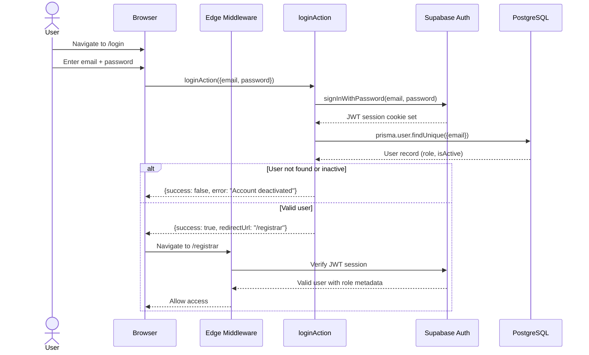

### 12.2 Middleware Logic

The middleware (`middleware.ts`) runs at the Vercel Edge for every request:

1. **Session Verification**: Creates Supabase SSR client, calls `getUser()`
2. **Dashboard Protection**: If unauthenticated and accessing `/registrar`, `/judge`, or `/lawyer` → redirect to `/login`
3. **Role Isolation**: If authenticated but accessing wrong role prefix (e.g., Lawyer accessing `/registrar`) → redirect to own dashboard
4. **Login Redirect**: If already authenticated and visiting `/login` → redirect to own dashboard
5. **Static Exclusions**: `_next/static`, `_next/image`, `favicon.ico`, and image files are excluded

### 12.3 Auth Helper — `getCurrentUser()`

- Wrapped with React 19 `cache()` for per-request memoization
- Calls Supabase Auth to get the authenticated user
- Cross-references with Prisma `User` table to resolve role and active status
- Returns `{id, name, email, role, isActive, createdAt}` or `null`

---

## 13. Input Validation

All user inputs are validated using **Zod schemas** — the same schemas are used both on the client (via `react-hook-form` + `zodResolver`) for inline error display and on the server for defense-in-depth.

### 13.1 Validation Schemas Summary

| Schema | Key Rules |
|--------|-----------|
| `loginSchema` | Email required + valid format; password ≥ 6 chars |
| `createUserSchema` | Name 2-100 chars; valid email (lowercased, trimmed); password ≥ 6 chars; role must be REGISTRAR/JUDGE/LAWYER |
| `createCourtroomSchema` | Name 1-100 chars; location ≤ 150 chars (optional); maxSlots 1-20 (integer) |
| `createCaseSchema` | Defendant name 2-100 chars; address 5-255 chars; crime type 2-100 chars; valid dates with cross-field rules (arrest ≥ crime date, completion ≥ trial start) |
| `recordJudgmentSchema` | CIN required; judgment date required; summary 10-5000 chars |
| `scheduleHearingSchema` | CIN required; hearing date required; courtroom UUID required |
| `recordAdjournmentSchema` | Hearing UUID; reason 5-500 chars; optional next date + courtroom |
| `recordSummarySchema` | Hearing UUID; summary 10-2000 chars; optional next date + courtroom |

### 13.2 Cross-Field Validations

- **Arrest date ≥ Crime date**: "Date of arrest cannot precede the crime commission date"
- **Expected completion ≥ Trial start**: "Expected completion date must be on or after trial start date"

---

## 14. Testing Strategy & Results

### 14.1 Testing Framework

| Type | Framework | Configuration |
|------|-----------|---------------|
| Unit Tests | Vitest | `vitest.config.ts` with path aliases matching `tsconfig.json` |
| E2E Tests | Playwright | `playwright.config.ts` targeting `http://localhost:3000` |

### 14.2 Unit Test Suites (48 Test Cases — 100% Pass Rate)

All unit tests mock Prisma and Supabase dependencies using `vi.mock()` to test business logic in isolation.

#### Suite 1: User Management (`user.actions.test.ts`) — 6 tests

| # | Test Case | What It Validates |
|---|-----------|-------------------|
| 1 | Rejects non-REGISTRAR callers | Role enforcement on account creation |
| 2 | Rejects duplicate email addresses | Unique constraint validation |
| 3 | Provisions user and logs audit | Full create flow + audit logging |
| 4 | Deactivates user and writes audit | Soft-delete flow + audit |
| 5 | Prevents self-deactivation | Administrative lockout protection |
| 6 | Inserts audit entry with correct fields | Audit helper schema mapping |

#### Suite 2: Case Registration (`case.actions.test.ts`) — 6 tests

| # | Test Case | What It Validates |
|---|-----------|-------------------|
| 1 | Rejects non-REGISTRAR callers | Role enforcement |
| 2 | Rejects when judge has wrong role | Personnel assignment validation |
| 3 | Creates case, generates CIN, writes audit | Full registration flow |
| 4 | Rejects missing required fields | Zod schema enforcement |
| 5 | Rejects non-REGISTRAR courtroom creation | Courtroom role enforcement |
| 6 | Rejects duplicate courtroom names | Unique name constraint |

#### Suite 3: Hearing Management (`hearing.actions.test.ts`) — 6 tests

| # | Test Case | What It Validates |
|---|-----------|-------------------|
| 1 | Reports slots accurately, detects judge conflict | Slot computation + conflict detection |
| 2 | Rejects scheduling if judge has conflict | Judge double-booking prevention |
| 3 | Rejects scheduling if courtroom at capacity | Slot capacity enforcement |
| 4 | Rejects adjournment with short reason | Zod minimum length validation |
| 5 | Records adjournment and updates case status | Full adjournment flow |
| 6 | Records proceeding summary and marks completed | Full completion flow |

#### Suite 4: Judgment & Resolution (`judgment.actions.test.ts`) — 8 tests

| # | Test Case | What It Validates |
|---|-----------|-------------------|
| 1 | Rejects unauthorized/non-Registrar users | Role enforcement |
| 2 | Rejects short judgment summary | Zod minimum length (10 chars) |
| 3 | Rejects judgment on REGISTERED case | Must have hearings first |
| 4 | Rejects duplicate judgment on closed case | Prevents overwriting |
| 5 | Creates judgment and closes case | Full judgment flow in transaction |
| 6 | Returns only pending cases | Correct status filter |
| 7 | Queries resolved cases in date range | Date boundary filtering |
| 8 | Queries cases by hearing date | Day-level date filtering |

#### Suite 5: Case View & Billing (`caseview.actions.test.ts`) — 9 tests

| # | Test Case | What It Validates |
|---|-----------|-------------------|
| 1 | Rejects non-LAWYER from billed view | Role enforcement |
| 2 | Rejects accessing non-closed cases | Status restriction |
| 3 | Logs CaseView with ₹50 fee + audit | Pay-per-view billing flow |
| 4 | Creates new CaseView each time | No caching — true pay-per-view |
| 5 | Rejects non-JUDGE from judge view | Role enforcement |
| 6 | Returns case without creating CaseView | Complimentary judge access |
| 7 | Aggregates billing data correctly | Billing summary computation |
| 8 | Restricts search to CLOSED for Judge/Lawyer | Search scope enforcement |
| 9 | Allows Registrar to search all statuses | Registrar search privilege |

#### Suite 6: Audit Log (`audit.actions.test.ts`) — 8 tests

| # | Test Case | What It Validates |
|---|-----------|-------------------|
| 1 | Rejects non-Registrar from audit logs | Role enforcement |
| 2 | Rejects unauthenticated requests | Auth enforcement |
| 3 | Applies all filter criteria correctly | Dynamic WHERE clause construction |
| 4 | Calculates pagination metadata | Skip/take/totalPages computation |
| 5 | Rejects non-Registrar from filter options | Role enforcement |
| 6 | Returns distinct filter dropdown values | Aggregation correctness |
| 7 | Creates audit record successfully | Audit helper insertion |
| 8 | Catches DB errors gracefully | Silent failure handling |

#### Suite 7: Analytics (`analytics.actions.test.ts`) — 5 tests

| # | Test Case | What It Validates |
|---|-----------|-------------------|
| 1 | Rejects unauthenticated requests | Auth enforcement |
| 2 | Rejects non-registrar roles | Role enforcement |
| 3 | Calculates accurate metrics | Clearance rate, hearing rates, utilization |
| 4 | Handles empty database without division-by-zero | Zero-data edge case |
| 5 | Catches internal errors gracefully | DB failure resilience |

### 14.3 End-to-End Test Suites (11 Test Cases)

#### Suite 1: Authentication & Role Routing (`auth.spec.ts`) — 5 tests

| # | Test Case | What It Validates |
|---|-----------|-------------------|
| 1 | Unauthenticated `/registrar` redirects to `/login` | Middleware protection |
| 2 | Unauthenticated `/judge` redirects to `/login` | Middleware protection |
| 3 | Unauthenticated `/lawyer` redirects to `/login` | Middleware protection |
| 4 | Empty form submission shows validation errors | Client-side Zod validation |
| 5 | Invalid credentials display error message | Server-side auth failure |

#### Suite 2: Case Lifecycle (`case-lifecycle.spec.ts`) — 3 tests

| # | Test Case | What It Validates |
|---|-----------|-------------------|
| 1 | Unauthenticated case registration redirects | Route protection |
| 2 | Unauthenticated courtroom access redirects | Route protection |
| 3 | Unauthenticated hearing scheduling redirects | Route protection |

#### Suite 3: Lawyer Billing (`lawyer-billing.spec.ts`) — 2 tests

| # | Test Case | What It Validates |
|---|-----------|-------------------|
| 1 | Unauthenticated lawyer history redirects | Route protection |
| 2 | Unauthenticated lawyer billing redirects | Route protection |

#### Suite 4: Account Management (`account-management.spec.ts`) — 1 test

| # | Test Case | What It Validates |
|---|-----------|-------------------|
| 1 | Unauthenticated personnel directory redirects | Route protection |

### 14.4 Running Tests

```bash
# Unit tests (Vitest)
npx vitest run

# Unit tests with coverage
npx vitest run --coverage

# E2E tests (Playwright) — requires dev server running
npx playwright test

# E2E tests with headed browser
npx playwright test --headed
```

### 14.5 Test Results Summary

```
 ✓ tests/unit/user.actions.test.ts (6 tests)
 ✓ tests/unit/case.actions.test.ts (6 tests)
 ✓ tests/unit/hearing.actions.test.ts (6 tests)
 ✓ tests/unit/judgment.actions.test.ts (8 tests)
 ✓ tests/unit/caseview.actions.test.ts (9 tests)
 ✓ tests/unit/audit.actions.test.ts (8 tests)
 ✓ tests/unit/analytics.actions.test.ts (5 tests)

 Test Files  7 passed (7)
      Tests  48 passed (48)
   Start at  ...
   Duration  ...
```

---

## 15. Edge Cases & Error Handling

### 15.1 Frontend Edge Cases

| Edge Case | How It's Handled |
|-----------|------------------|
| Empty form submission | Zod validation displays inline field-level errors (not toasts) |
| Network failure during form submit | `useTransition` catches errors; error banner displayed |
| Direct URL navigation to unauthorized route | Middleware redirects to correct dashboard |
| Authenticated user visits `/login` | Middleware auto-redirects to their dashboard |
| Browser back button after logout | Session invalidated; middleware redirects to `/login` |
| Very long defendant names / addresses | Zod `max()` constraints truncate at defined limits |
| Date fields with invalid values | `z.coerce.date()` catches and reports parsing errors |
| Arrest date before crime date | Cross-field Zod refinement rejects with targeted error |
| Expected completion before trial start | Cross-field Zod refinement rejects with targeted error |
| Case CIN not found | Server Component renders 404-style "Case not found" message |
| Empty data tables | Styled empty state messages (not blank screens) |
| Page loading states | Skeleton loaders (`TableSkeleton`) on all 7 dashboard views |

### 15.2 Backend Edge Cases

| Edge Case | How It's Handled |
|-----------|------------------|
| Registrar tries to deactivate themselves | Explicit check prevents self-deactivation to avoid lockout |
| Duplicate email on account creation | Prisma unique check before Supabase provisioning |
| Duplicate courtroom name | Prisma unique check rejects with descriptive error |
| Assigning a Lawyer as a Judge on a case | Server action verifies `role === "JUDGE"` before accepting |
| Assigning an inactive user to a case | Server action verifies `isActive === true` for all assigned personnel |
| Scheduling hearing on a full courtroom | Action counts existing hearings vs `maxSlots` and rejects |
| Judge already has hearing on the same date | Action checks for existing judge hearings on target date |
| Recording judgment on REGISTERED case (no hearings) | Action rejects: case must have at least one hearing first |
| Recording duplicate judgment on already-closed case | Action checks for existing judgment and rejects |
| Lawyer accessing a PENDING case | Action verifies case status is CLOSED/RESOLVED only |
| Empty database (zero cases, zero hearings) | Analytics action handles division-by-zero (returns 0% rates) |
| Audit logging failure | `logAudit()` catches errors silently (returns null) so primary transaction is not interrupted |
| Deactivated user attempts login | `loginAction` checks `isActive` after Supabase auth; rejects with "Account deactivated" |

### 15.3 Integration Edge Cases

| Edge Case | How It's Handled |
|-----------|------------------|
| Prisma and Supabase Auth out of sync | `loginAction` verifies user exists in BOTH Supabase Auth AND Prisma User table |
| Concurrent hearing scheduling | Prisma checks slot capacity at query time; last writer wins (acceptable for court schedules) |
| Judgment + status update atomicity | `recordJudgmentAction` uses `prisma.$transaction()` to ensure Judgment creation and Case status update succeed together |
| Hot-reload connection exhaustion (dev) | Prisma client uses singleton pattern with `globalThis` to prevent connection pool depletion |
| Supabase cookie handling in Server Components | Try-catch guard in cookie setter for read-only RSC contexts |
| Next.js dynamic rendering detection | `getCurrentUser()` catches and re-throws `DYNAMIC_SERVER_USAGE` errors |

---

## 16. Deployment Architecture

### 16.1 Production Deployment

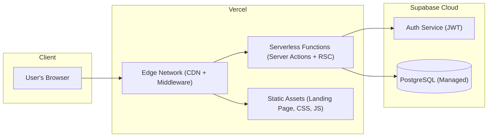

### 16.2 Environment Variables

| Variable | Purpose |
|----------|---------|
| `DATABASE_URL` | Prisma connection string (pooled) |
| `DIRECT_URL` | Direct Postgres connection for migrations |
| `NEXT_PUBLIC_SUPABASE_URL` | Supabase project URL |
| `NEXT_PUBLIC_SUPABASE_ANON_KEY` | Supabase anonymous key |
| `SUPABASE_SERVICE_ROLE_KEY` | Admin key for user provisioning |

### 16.3 Build Process

```bash
# Production build
npm run build
# Executes: prisma generate && next build --turbopack

# Development
npm run dev

# Database migrations
npx prisma migrate dev

# Seed development data
npx prisma db seed
```

---

## 17. Conclusion

The Judiciary Information System (JIS) successfully implements all 21 functional requirements and 10 non-functional requirements specified in the Software Requirements Specification. The system provides:

- **Complete case lifecycle management** from registration through judgment and archival
- **Three-tier role-based access** with defense-in-depth enforcement at middleware, server action, and database levels
- **Immutable audit trail** for every administrative mutation
- **Pay-per-view billing** for lawyer case access with full itemized ledger
- **Visual analytics dashboard** with custom SVG charts for judicial caseload intelligence
- **Professional government records aesthetic** using a cohesive neoclassical design language
- **Comprehensive test coverage** with 48 unit tests (100% pass rate) and 11 E2E integration tests

The architecture is designed for maintainability (typed Prisma schema, layered structure), scalability (managed Supabase infrastructure, indexed queries), and security (Supabase Auth, RLS policies, Zod validation at every boundary).

---

*Report generated for Software Engineering course submission.*  
*Technology: Next.js 15 · TypeScript · Prisma · Supabase Postgres*
