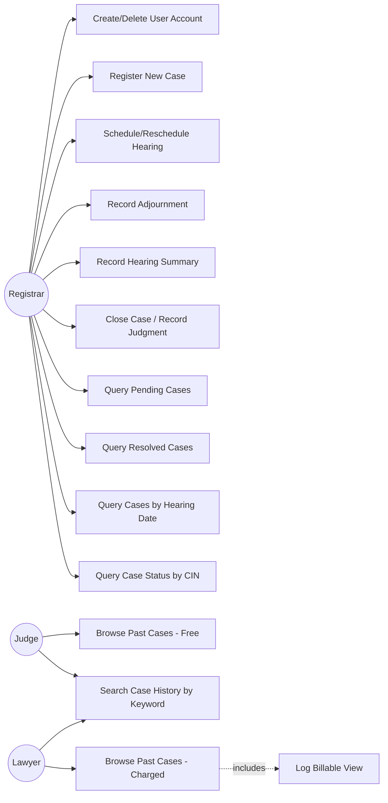
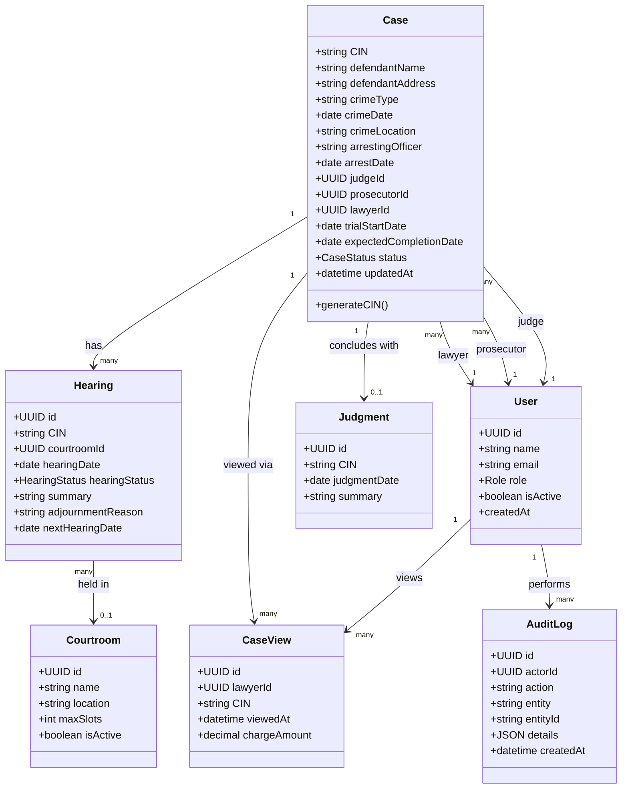
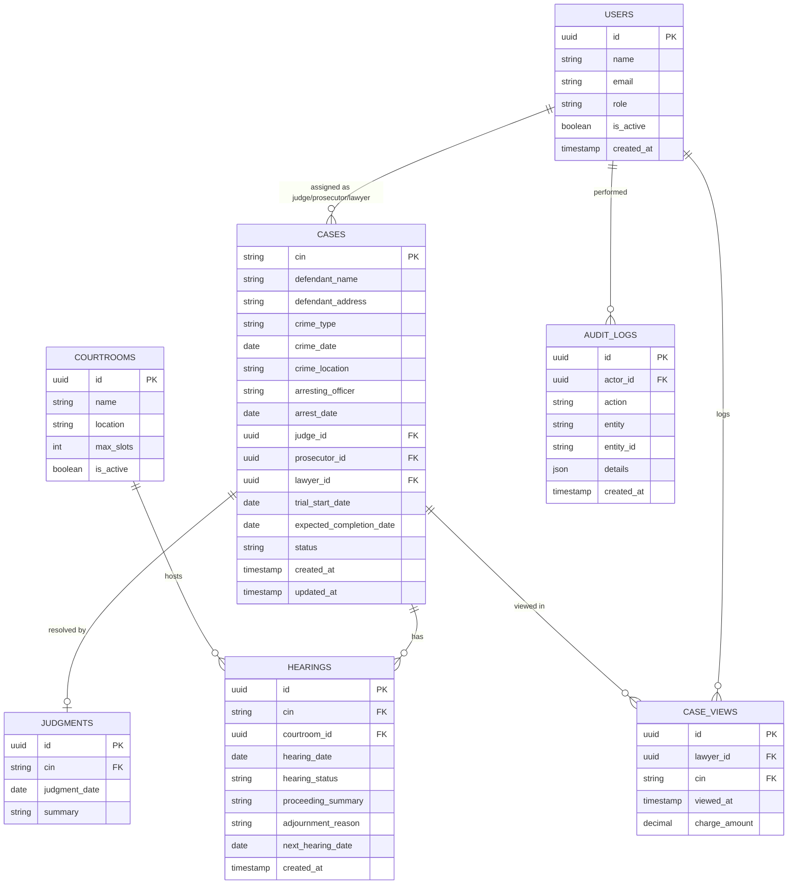
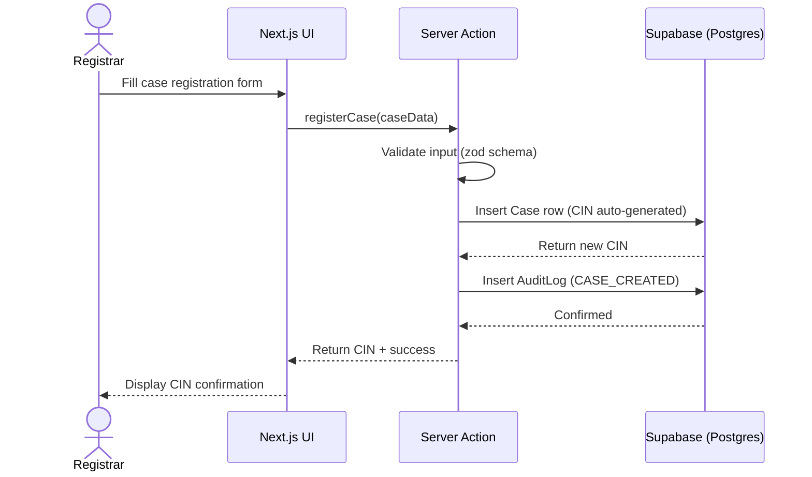
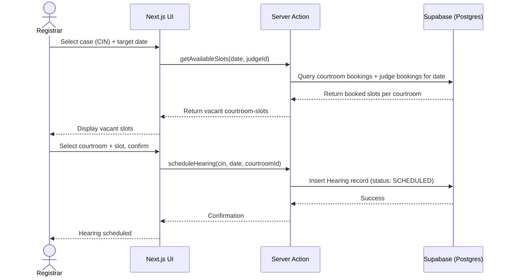
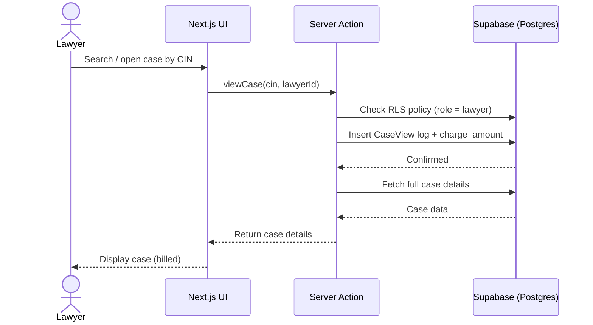
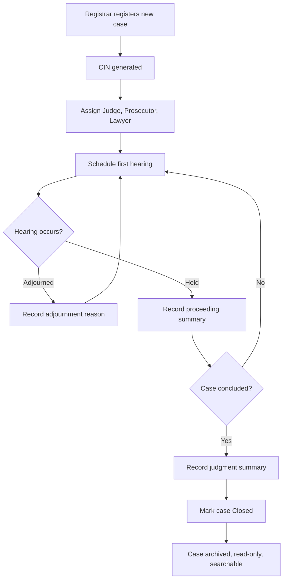
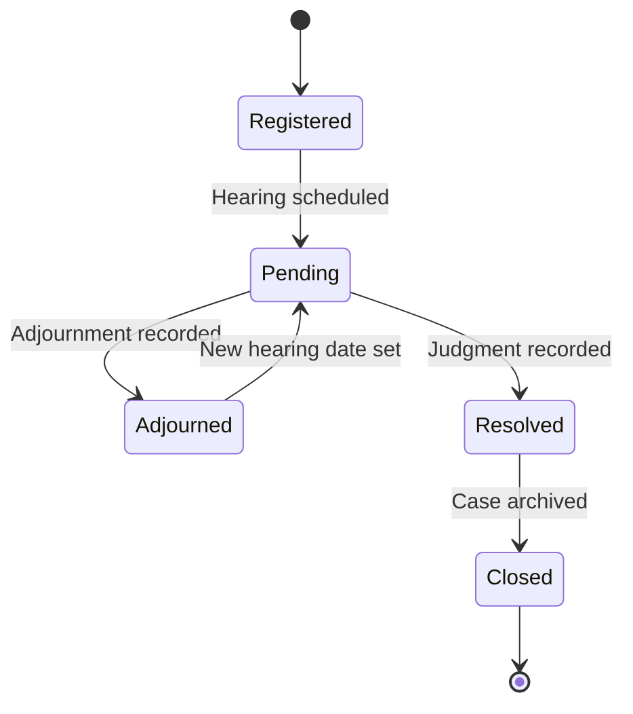
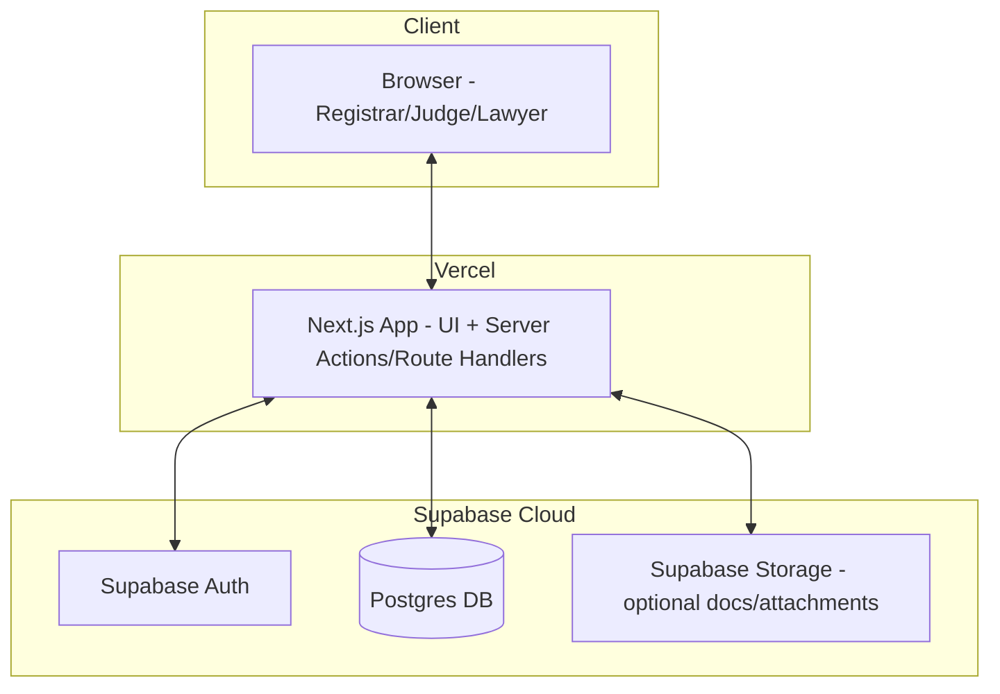

# Judiciary Information System (JIS) — Project Plan

**Course:** Software Engineering
**Build tool:** Antigravity IDE (Gemini 3.1 Pro / 3.8 Flash + Claude)
**Methodology:** Agile-inspired, document-driven (Waterfall artifacts, Agile execution) — standard for an academic SE project that must show full SDLC evidence while still shipping working software.

---

## 1. Tech Stack

| Layer | Technology | Version (pin this) |
|---|---|---|
| Framework | Next.js (App Router) | 15.x |
| Language | TypeScript | 5.6+ |
| UI Library | React | 19.x |
| Styling | Tailwind CSS | 4.x |
| Component Library | shadcn/ui | latest (CLI-installed, not versioned as a package) |
| Icons | lucide-react | latest |
| Backend logic | Next.js Route Handlers + Server Actions | — |
| Database | Supabase Postgres | — |
| Auth | Supabase Auth (email/password, role-based) | — |
| ORM | Prisma | 5.x |
| Form handling | react-hook-form + zod | latest |
| State (client) | React Server Components + minimal useState/useReducer (avoid Redux — overkill here) | — |
| Testing (unit) | Vitest | latest |
| Testing (E2E) | Playwright | latest |
| Diagrams | Mermaid (in-repo, version-controlled) | — |
| Deployment | Vercel (app) + Supabase Cloud (DB/Auth) | — |
| Version Control | Git + GitHub (Issues/Projects for SDLC trail) | — |

**Architecture pattern presented in documentation:** Layered/3-tier —
Presentation (Next.js UI) → Application/Business Logic (Server Actions & Route Handlers) → Data (Prisma → Supabase Postgres, with Row-Level Security as a defense-in-depth layer) → Identity (Supabase Auth).

---

## 2. SDLC Phases & Deliverables Checklist

| Phase | Deliverable | Status |
|---|---|---|
| 1. Requirements | SRS (Functional + Non-Functional Requirements) — Section 3 | ☐ |
| 2. Analysis & Design | Use Case Diagram, Class Diagram, ER Diagram, Sequence Diagrams, Activity Diagram, State Diagram, Component/Deployment Diagram — Section 4 | ☐ |
| 3. Database Design | Full schema (Prisma) — Section 5 | ☐ |
| 4. System Design | RBAC matrix, API/route map, folder structure — Section 6 & 7 | ☐ |
| 5. UI/UX Design | Page inventory, wireframe notes, design system rules — Section 8 | ☐ |
| 6. Implementation | Actual Next.js + Supabase app (built in Antigravity) | ☐ |
| 7. Testing | Test plan: unit, integration, E2E, UAT cases — Section 9 | ☐ |
| 8. Deployment | Vercel + Supabase deployment doc | ☐ |
| 9. Maintenance/Docs | User manual, README, final report | ☐ |

---

## 3. Software Requirements Specification (SRS)

### 3.1 Functional Requirements (FR)

**Module A — User & Account Management**
- FR1: Registrar can create login accounts for Judges, Lawyers, and other Registrars, assigning a role at creation.
- FR2: Registrar can delete/deactivate any login account.
- FR3: System must authenticate users and restrict features by role (Registrar / Judge / Lawyer).
- FR4: System must track, per lawyer account, the count and log of each old case viewed (for billing).

**Module B — Case Registration**
- FR5: Registrar can create a new court case by entering: defendant name, defendant address, crime type, date crime committed, location of crime, arresting officer name, date of arrest.
- FR6: System auto-generates a unique Case Identification Number (CIN) on case creation.
- FR7: Registrar additionally records: presiding judge, public prosecutor, defense lawyer, trial start date, expected completion date.

**Module C — Hearing Scheduling**
- FR8: System displays available (vacant) hearing slots for any selected working day, given judge/courtroom availability.
- FR9: Registrar assigns a hearing date to a case from the displayed vacant slots.
- FR10: On adjournment, registrar records a reason for adjournment and assigns a new hearing date.
- FR11: After a hearing occurs, registrar records a summary of proceedings and assigns the next hearing date (if not concluded).

**Module D — Case Resolution**
- FR12: On completion, registrar records the judgment summary and marks the case as "Closed"/"Resolved".
- FR13: Closed case records and their full history must remain permanently accessible (read-only) for future reference.

**Module E — Registrar Queries**
- FR14: Query pending cases, sorted by CIN, showing: start date, defendant name & address, crime details, lawyer name, prosecutor name, judge name.
- FR15: Query resolved cases within a given date range, chronologically listing: start date, CIN, judgment date, judge name, judgment summary.
- FR16: Query cases scheduled for hearing on a specific date.
- FR17: Query full status/history of a specific case by CIN.

**Module F — Case History & Search (Lawyers/Judges)**
- FR18: Judges can browse full details of any past (closed) case at no charge.
- FR19: Lawyers can browse past case details but are charged per case viewed; each view is logged against their account.
- FR20: Keyword search across past case records (e.g., by crime type, defendant name, judge, judgment terms).

**Module G — Audit & History**
- FR21: All adjournments, hearing summaries, and judgment entries must be stored as an immutable, timestamped history per case (not overwritten).

### 3.2 Non-Functional Requirements (NFR)

| # | Category | Requirement |
|---|---|---|
| NFR1 | Security | Role-based access control enforced at both application and database (RLS) level; passwords hashed via Supabase Auth; no direct DB access outside the app. |
| NFR2 | Data Integrity | Case history (adjournments, hearings, judgments) is append-only — never destructively edited or deleted. |
| NFR3 | Availability | System should target 99% uptime during court working hours (Vercel/Supabase managed infra). |
| NFR4 | Performance | Case queries (pending list, date-range search) should return results in under 2 seconds for datasets up to ~50,000 cases. |
| NFR5 | Usability | UI must be usable by non-technical registrars/judges with minimal training; consistent shadcn/ui design system throughout. |
| NFR6 | Scalability | Schema and architecture should support adding more courts/branches without redesign. |
| NFR7 | Auditability | Every billable lawyer case-view and every account creation/deletion must be logged with timestamp and actor. |
| NFR8 | Maintainability | Codebase organized in layered structure (Section 7) with typed schema (Prisma) to keep DB and code in sync. |
| NFR9 | Accessibility | UI should meet basic WCAG 2.1 AA practices (contrast, keyboard navigation, semantic HTML via shadcn). |
| NFR10 | Portability | Application deployable to any standard Node.js hosting environment; database is standard Postgres (not vendor-locked logic). |

---

## 4. UML Models (Mermaid — render directly in GitHub/VS Code/Antigravity)

### 4.1 Use Case Diagram



### 4.2 Class Diagram



### 4.3 ER Diagram



### 4.4 Sequence Diagram — Register a New Case



### 4.5 Sequence Diagram — Schedule a Hearing



### 4.6 Sequence Diagram — Lawyer Views Old Case (Billable)



### 4.7 Activity Diagram — Case Lifecycle



### 4.8 State Diagram — Case Status



### 4.9 Component / Deployment Diagram



---

## 5. Database Schema (Prisma-style)

```prisma
enum Role {
  REGISTRAR
  JUDGE
  LAWYER
}

enum CaseStatus {
  REGISTERED
  PENDING
  ADJOURNED
  RESOLVED
  CLOSED
}

enum HearingStatus {
  SCHEDULED
  COMPLETED
  ADJOURNED
}

model User {
  id           String   @id @default(uuid())
  name         String
  email        String   @unique
  role         Role
  isActive     Boolean  @default(true)
  createdAt    DateTime @default(now())

  judgeCases       Case[]     @relation("JudgeCases")
  prosecutorCases  Case[]     @relation("ProsecutorCases")
  lawyerCases      Case[]     @relation("LawyerCases")
  caseViews        CaseView[]
  auditLogs        AuditLog[]

  @@index([role])
}

model Courtroom {
  id            String   @id @default(uuid())
  name          String   @unique
  location      String?
  maxSlots      Int      @default(5)    // max hearings per day in this courtroom
  isActive      Boolean  @default(true)

  hearings  Hearing[]
}

model Case {
  cin                     String     @id @default(cuid())
  defendantName           String
  defendantAddress        String
  crimeType               String
  crimeDate               DateTime
  crimeLocation           String
  arrestingOfficer        String
  arrestDate              DateTime
  trialStartDate          DateTime
  expectedCompletionDate  DateTime
  status                  CaseStatus @default(REGISTERED)
  createdAt               DateTime   @default(now())
  updatedAt               DateTime   @updatedAt

  judgeId       String
  prosecutorId  String
  lawyerId      String
  judge         User @relation("JudgeCases", fields: [judgeId], references: [id])
  prosecutor    User @relation("ProsecutorCases", fields: [prosecutorId], references: [id])
  lawyer        User @relation("LawyerCases", fields: [lawyerId], references: [id])

  hearings   Hearing[]
  judgment   Judgment?
  caseViews  CaseView[]

  @@index([status])
  @@index([judgeId])
  @@index([lawyerId])
  @@index([crimeType])
  @@index([defendantName])
  @@index([trialStartDate])
}

model Hearing {
  id                 String        @id @default(uuid())
  cin                String
  courtroomId        String?
  hearingDate        DateTime
  hearingStatus      HearingStatus @default(SCHEDULED)
  proceedingSummary  String?
  adjournmentReason  String?
  nextHearingDate    DateTime?
  createdAt          DateTime      @default(now())

  case      Case       @relation(fields: [cin], references: [cin])
  courtroom Courtroom? @relation(fields: [courtroomId], references: [id])

  @@index([cin])
  @@index([hearingDate])
  @@index([courtroomId, hearingDate])
}

model Judgment {
  id           String   @id @default(uuid())
  cin          String   @unique
  judgmentDate DateTime
  summary      String

  case Case @relation(fields: [cin], references: [cin])

  @@index([judgmentDate])
}

model CaseView {
  id           String   @id @default(uuid())
  lawyerId     String
  cin          String
  viewedAt     DateTime @default(now())
  chargeAmount Decimal  @default(0)

  lawyer User @relation(fields: [lawyerId], references: [id])
  case   Case @relation(fields: [cin], references: [cin])

  @@index([lawyerId])
  @@index([cin])
}

model AuditLog {
  id         String   @id @default(uuid())
  actorId    String
  action     String       // e.g. "USER_CREATED", "USER_DEACTIVATED", "CASE_STATUS_CHANGED"
  entity     String       // e.g. "User", "Case", "Hearing"
  entityId   String       // PK of the affected row
  details    Json?        // optional structured payload (old/new values, etc.)
  createdAt  DateTime @default(now())

  actor User @relation(fields: [actorId], references: [id])

  @@index([actorId])
  @@index([entity, entityId])
  @@index([createdAt])
}
```

**Note on RLS:** In addition to Prisma-level relations, define Supabase Row-Level Security policies so that: Lawyers can only `SELECT` case rows through a logged view-and-charge function (never a raw table select); Judges get free `SELECT` on closed cases; Registrar has full CRUD. The `AuditLog` table should be INSERT-only for application roles and readable only by Registrars.

---

## 6. Roles & Permissions Matrix

| Action | Registrar | Judge | Lawyer |
|---|---|---|---|
| Create/delete user accounts | ✅ | ❌ | ❌ |
| Manage courtrooms | ✅ | ❌ | ❌ |
| Register new case | ✅ | ❌ | ❌ |
| Schedule/adjourn hearing | ✅ | ❌ | ❌ |
| Record hearing summary/judgment | ✅ | ❌ | ❌ |
| Query pending/resolved cases | ✅ | ❌ | ❌ |
| Query case status by CIN | ✅ | ❌ | ❌ |
| Browse closed case (free) | ✅ | ✅ | ❌ |
| Browse closed case (charged) | — | — | ✅ |
| Keyword search history | ✅ | ✅ | ✅ |
| View own billing/view log | ❌ | ❌ | ✅ |
| View audit logs | ✅ | ❌ | ❌ |

---

## 7. Project Folder Structure (Next.js App Router)

```
jis-app/
├── app/
│   ├── (auth)/login/
│   ├── (dashboard)/
│   │   ├── registrar/
│   │   │   ├── cases/            # register, list, query pending/resolved
│   │   │   ├── hearings/         # schedule, adjourn
│   │   │   ├── courtrooms/       # manage courtrooms
│   │   │   ├── accounts/         # create/delete users
│   │   │   └── audit/            # view audit logs
│   │   ├── judge/
│   │   │   └── history/          # browse + search, free
│   │   └── lawyer/
│   │       ├── history/          # browse + search, charged
│   │       └── billing/          # view log & charges
│   └── api/                      # route handlers (webhooks, exports, etc.)
├── actions/                      # server actions (business logic layer)
│   ├── case.actions.ts
│   ├── hearing.actions.ts
│   ├── user.actions.ts
│   ├── caseView.actions.ts
│   ├── courtroom.actions.ts
│   └── audit.actions.ts
├── lib/
│   ├── supabase/                 # client + server supabase instances
│   ├── prisma.ts
│   └── validators/                # zod schemas
├── types/                         # shared TypeScript types & enums
├── components/
│   ├── ui/                       # shadcn components
│   └── shared/
├── prisma/
│   └── schema.prisma
├── tests/
│   ├── unit/
│   └── e2e/
└── docs/
    ├── SRS.md
    ├── UML/
    └── test-plan.md
```

---

## 8. UI/UX Plan (shadcn/ui)

**Design principles:** clean, formal, high-trust aesthetic appropriate for a judiciary system (avoid playful colors; use a restrained neutral palette with a single accent, e.g. deep navy/slate + gold or maroon accent). Use shadcn `Table`, `Card`, `Dialog`, `Form`, `Calendar`/`DatePicker`, `Badge` (for case status), `Command` (for keyword search), `Tabs` (role dashboards), `Sonner`/`Toast` (confirmations).

**Key screens:**
1. Login (role-based redirect)
2. Registrar Dashboard — quick stats (pending count, today's hearings)
3. Register New Case (multi-step form)
4. Case List / Query views (pending, resolved-by-range, by-hearing-date) — filterable data table
5. Case Detail view — timeline of hearings/adjournments + judgment (shared component, permission-gated)
6. Schedule Hearing modal — calendar with vacant slots highlighted per courtroom
7. Judge Dashboard — history search, saved/recent cases
8. Lawyer Dashboard — history search (with cost-per-view notice), billing/usage log
9. Account Management (Registrar) — user table, create/deactivate modal
10. Courtroom Management (Registrar) — courtroom list, create/edit/deactivate
11. Audit Log Viewer (Registrar) — filterable, read-only log of system actions

---

## 9. Testing Plan

| Type | Tool | Scope |
|---|---|---|
| Unit tests | Vitest | Server actions (CIN generation, slot calculation, charge calculation, status transitions) |
| Integration tests | Vitest + test DB | Prisma queries, RLS policy behavior per role |
| E2E tests | Playwright | Full flows: register case → schedule → adjourn → hearing → judgment → closed; lawyer view + charge log; account creation/deletion |
| UAT | Manual checklist | Registrar, Judge, Lawyer personas walk through FR1–FR21 |

**Sample test cases (excerpt):**
- TC1: Registering a case auto-generates a unique CIN — Expected: no duplicate CIN across 1000 test inserts.
- TC2: Requesting vacant slots for a date with 3 existing bookings returns correct remaining slots based on courtroom `maxSlots`.
- TC3: Lawyer viewing the same case twice logs two separate `CaseView` rows and two charges.
- TC4: Judge viewing a closed case does NOT create a charge record.
- TC5: Deleted/deactivated user cannot log in.
- TC6: Adjournment without a reason is rejected by form validation (NFR/data integrity).
- TC7: Closed case data remains fully readable and unmodifiable via UI.
- TC8: Scheduling a hearing when a courtroom is at max capacity for that date is rejected — Expected: error message, no Hearing row inserted.
- TC9: AuditLog rows cannot be updated or deleted through the application — Expected: only INSERT operations succeed; UPDATE/DELETE rejected by RLS.

---

## 10. Suggested Timeline (example — adjust to your course calendar)

| Week | Milestone |
|---|---|
| 1 | Finalize SRS, UML diagrams (this document) |
| 2 | DB schema + Supabase setup + Auth + RLS policies + Courtroom seed data |
| 3 | Registrar module: case registration, hearing scheduling |
| 4 | Registrar queries (pending/resolved/by-date/status) |
| 5 | Judge & Lawyer history browsing + keyword search |
| 6 | Billing/charge logging for lawyers + account management |
| 7 | UI polish (shadcn), testing (unit + E2E) |
| 8 | UAT, bug fixes, deployment, final report/demo |

---

## 11. Risk Register (lightweight)

| Risk | Impact | Mitigation |
|---|---|---|
| RLS misconfiguration exposes case data to wrong role | High | Write explicit RLS test cases per role before feature sign-off |
| CIN collision under concurrent case creation | Medium | Use DB-level unique constraint + retry-on-conflict logic |
| Courtroom double-booking under concurrent scheduling | Medium | Use DB-level unique constraint on `(courtroomId, hearingDate)` composite or check-then-insert inside a serializable transaction |
| Scope creep (billing/payment gateway) | Medium | Keep "charge" as a logged amount only — no real payment integration required per problem statement |
| AI-IDE generating inconsistent code between Gemini/Claude passes | Medium | Keep this plan.md and prisma/schema.prisma as the single source of truth; regenerate against them each session |

---

